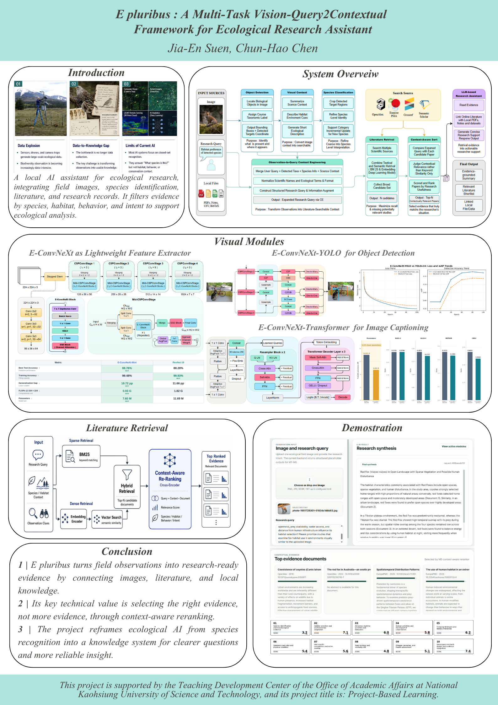
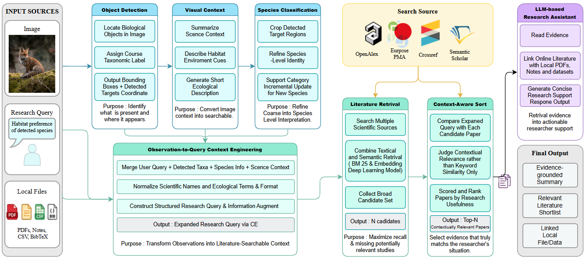
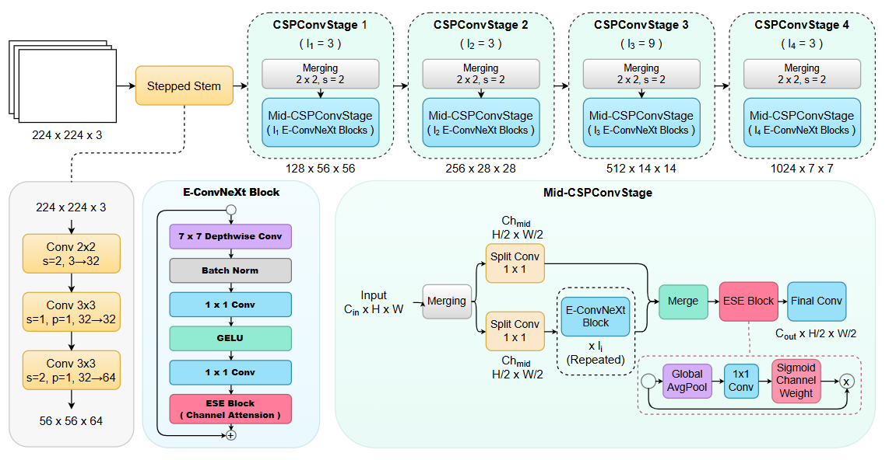
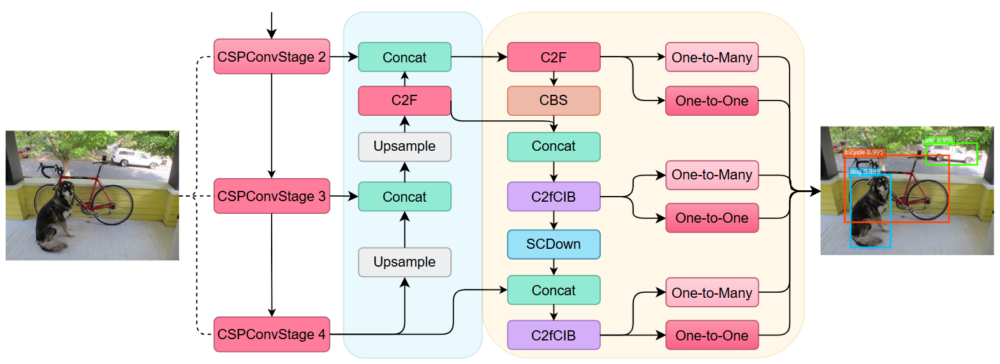
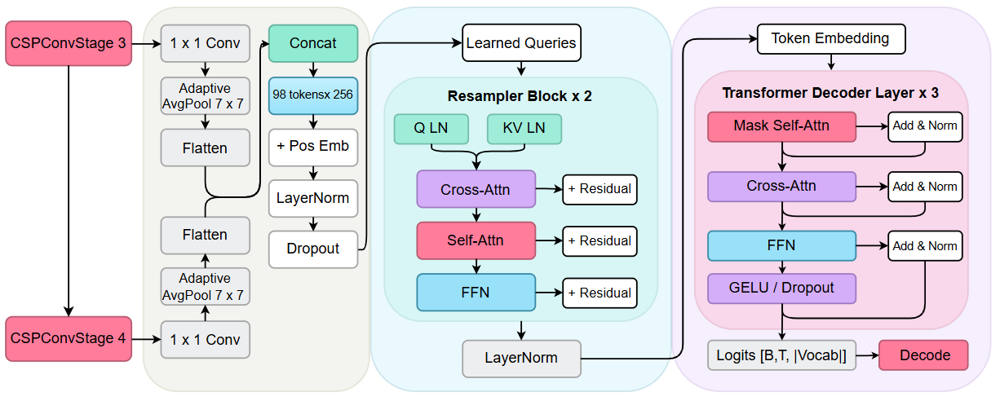
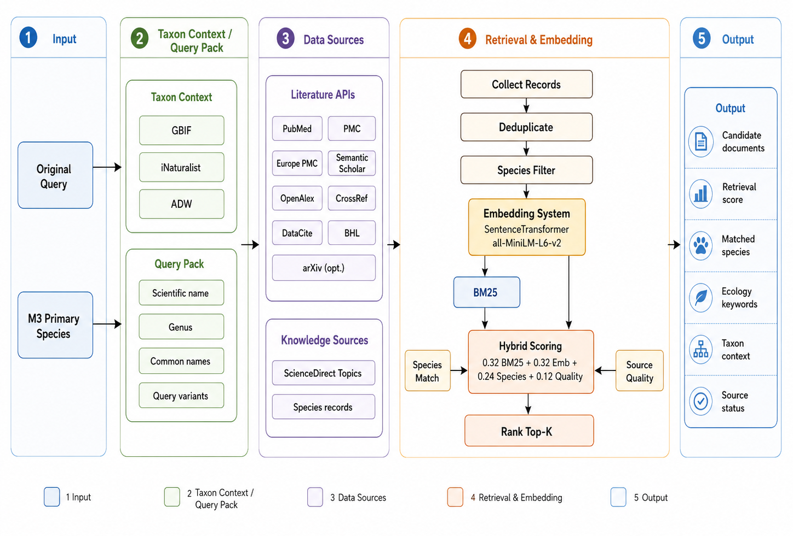
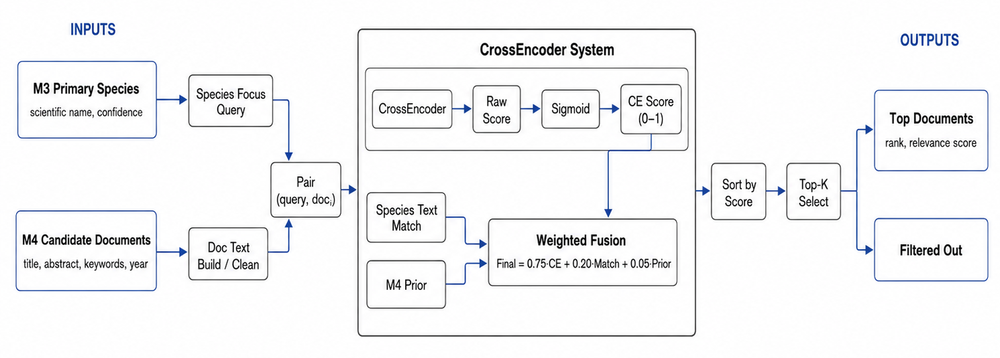
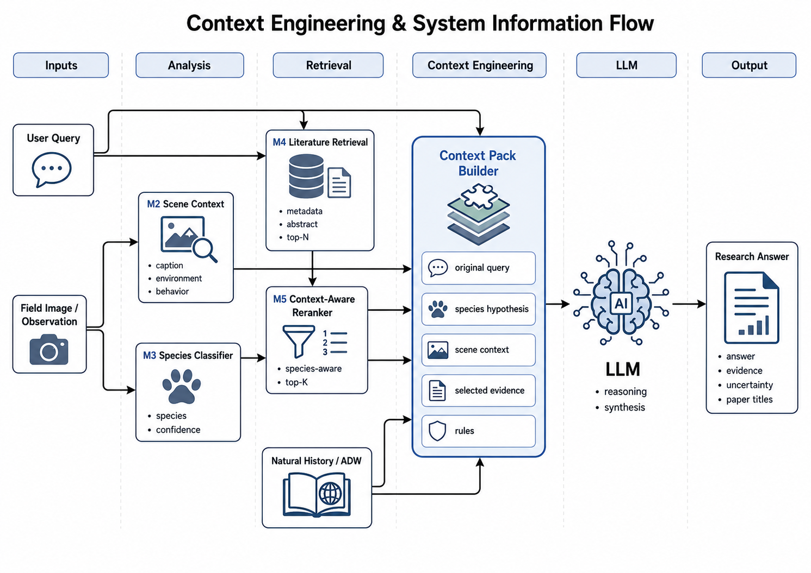

<div align="center">

  

# E pluribus : A Multi-Task Vision-Query2Contextual Framework for Ecological Research Assistant

*AI-powered ecological research assistant integrating species recognition, literature retrieval, and context-aware knowledge synthesis.*

</div>

---

This is a lightweight Flask prototype for an ecological research assistant. The frontend accepts one image and one research query, then displays the final LLM-style synthesis, module trace, uncertainty notes, and top evidence documents.

The backend is intentionally modular. The default M1–M6 modules return placeholder outputs so the UI and pipeline can be tested before trained models, retrieval services, rerankers, or local LLM endpoints are connected.

---

## Research Project & Product

<p align="center">
  
</p>

---

## System Architecture

<p align="center">
  
</p>

```text
User image + query
  -> M1 Visual Detection
  -> M2 Visual Context Description
  -> M3 Species Refinement and CIL
  -> M4 Hybrid Literature Retrieval
  -> M5 Context-aware EcoReranker
  -> M6 Local LLM Synthesis
  -> Flask JSON response + browser UI
```

---

## E-ConvNeXt Model Applications

<table>
  <tr>
    <th align="center" width="33%">Feature Extractor</th>
    <th align="center" width="33%">YOLO-v10n Backbone</th>
    <th align="center" width="33%">Tiny Image Captioning</th>
  </tr>
  <tr>
    <td align="center" valign="middle">
      
    </td>
    <td align="center" valign="middle">
      
    </td>
    <td align="center" valign="middle">
      
    </td>
  </tr>
  <tr>
    <td align="center" valign="top">
      <sub>E-ConvNeXt as a lightweight feature extractor.</sub>
    </td>
    <td align="center" valign="top">
      <sub>E-ConvNeXt as the backbone of YOLO-v10n.</sub>
    </td>
    <td align="center" valign="top">
      <sub>E-ConvNeXt with a Light Transformer decoder.</sub>
    </td>
  </tr>
</table>

### Detailed Sub-Experiment Projects

Explore the implementation details, training configurations, and experimental results of each E-ConvNeXt application:

| Project                          | Application                                                        |                                                        Repository                                                        |
| :------------------------------- | :----------------------------------------------------------------- | :----------------------------------------------------------------------------------------------------------------------: |
| **E-ConvNeXt**                   | Lightweight image classification and feature extraction            |     [View Project →](https://github.com/JiaenSuen/VisionLab/tree/main/ImageClassification/%40Models/2025_E-ConvNeXt)     |
| **E-ConvNeXt-YOLO**              | E-ConvNeXt integrated as the YOLO-v10n backbone                    |          [View Project →](https://github.com/JiaenSuen/VisionLab/tree/main/ObjectDetection/2025_E-ConvNeXt-YOLO)         |
| **E-ConvNeXt-Light-Transformer** | Lightweight encoder–decoder architecture for tiny image captioning | [View Project →](https://github.com/JiaenSuen/VisionLab/tree/main/TinyImageCaptioning/2025_E-ConvNeXt-Light-Transformer) |

---

## Hybrid Retrieval & Contextual Re-Ranker

<table>
  <tr>
    <th align="center" width="33%">Hybrid Retrieval Framework</th>
    <th align="center" width="33%">Cross Encoder Re-Ranker</th>
    <th align="center" width="33%">Contexiual Information Flow</th>
  </tr>
  <tr>
    <td align="center" valign="middle">
      
    </td>
    <td align="center" valign="middle">
      
    </td>
    <td align="center" valign="middle">
      
    </td>
  </tr>
  <tr>
    <td align="center" valign="top">
      <sub>Generate candidate using hybrid search.</sub>
    </td>
    <td align="center" valign="top">
      <sub>Using semantic reordering to fit the context.</sub>
    </td>
    <td align="center" valign="top">
      <sub>Exquisitely designed information flow network.</sub>
    </td>
  </tr>
</table>

---

## Quick start

```bash
cd ecosystem_flask_prototype
python -m venv .venv
source .venv/bin/activate  # Windows: .venv\Scripts\activate
pip install -r requirements.txt
python run.py
```

Open:

```text
http://127.0.0.1:5000
```

---

## Main folders

```text
app/
  routes.py                 Flask routes and API endpoints
  services/pipeline.py      Pipeline orchestrator
  services/storage.py       Upload handling
  modules/registry.py       Dynamic module loader
  modules/defaults/         Placeholder M1-M6 modules
  modules/custom/           Drop-in custom modules
  modules/examples/         Example module template
  templates/index.html      Frontend page
  static/css/styles.css     Research-oriented UI styles
  static/js/app.js          Frontend behavior
uploads/                    Runtime uploaded images
data/local_memory/          Future local research memory location
```

---

## API endpoints

### `GET /`

Renders the browser interface.

### `POST /api/analyze`

Multipart form fields:

| Field   | Type | Required | Description                            |
| :------ | ---: | -------: | :------------------------------------- |
| `image` | file |      yes | One ecological observation image.      |
| `query` | text |      yes | Research question or retrieval intent. |

### `GET /api/modules`

Returns active module metadata.

### `GET /healthz`

Health check.

---

## Drop-in module contract

Place a `.py` file in:

```text
app/modules/custom/
```

Restart Flask after adding or editing a module.

To replace a default module, use the same `MODULE_ID`. To add a new stage, use a new `MODULE_ID` and set `MODULE_ORDER` between the stages where it should run.

```python
from app.modules.base import ensure_context

MODULE_ID = "m5_reranker"
MODULE_NAME = "My Context-aware EcoReranker"
MODULE_ORDER = 50
MODULE_SOURCE = "custom"
MODULE_DESCRIPTION = "Custom cross-encoder reranker."


def process(context):
    ensure_context(context)
    query = context["request"]["query"]
    candidates = context["outputs"]["m4_retrieval"]["data"]["candidate_documents"]

    # Run your model here.
    return {
        "reranker": "your model name",
        "top_documents": candidates[:3],
    }
```

---

## Context object

Each module receives:

```python
context = {
    "request": {
        "id": "request id",
        "query": "user query",
        "image_path": "server path",
        "image_url": "browser-accessible URL",
        "image_name": "saved filename",
        "created_at": "UTC ISO timestamp",
    },
    "outputs": {
        "m1_detector": {"status": "ok", "data": {...}},
        "m2_context": {"status": "ok", "data": {...}},
        # More previous module outputs.
    },
}
```

---

## Default modules

| ID              | Stage | Purpose                                                       |
| :-------------- | :---: | :------------------------------------------------------------ |
| `m1_detector`   |   M1  | Placeholder genus-level detection and bounding boxes.         |
| `m2_context`    |   M2  | Placeholder visual context caption and query expansion terms. |
| `m3_classifier` |   M3  | Placeholder species candidates and CIL metric stubs.          |
| `m4_retrieval`  |   M4  | Placeholder hybrid retrieval and compact document cards.      |
| `m5_reranker`   |   M5  | Placeholder contextual relevance scoring and top documents.   |
| `m6_llm`        |   M6  | Placeholder local LLM synthesis and evidence package.         |

---

## Notes for connecting real models

1. Keep the module output schema stable while swapping internals.
2. Store heavy model files outside the repository and load them via environment variables.
3. Use `data/local_memory/` for future parsed PDFs, field notes, CSVs, BibTeX exports, and local embeddings.
4. Add authentication before using this outside a local machine or lab network.
